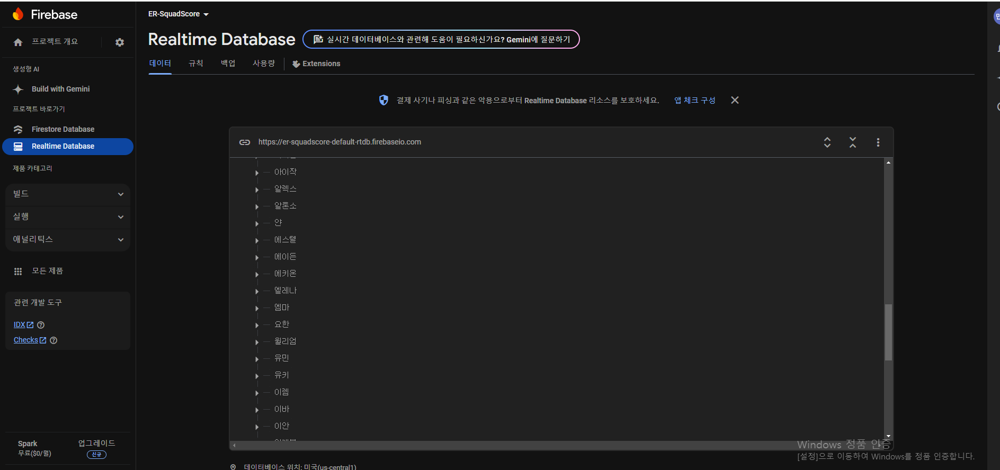
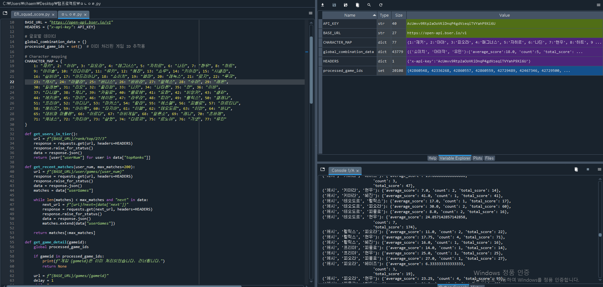

# ER(이터널 리턴) 캐릭터 조합 추천 시스템

이 프로젝트는 [이터널 리턴](https://playeternalreturn.com)의 데이터를 기반으로 최적의 캐릭터 조합을 추천하는 시스템입니다. 데이터를 활용하여 협업 필터링 기반으로 최적의 캐릭터 조합을 분석하고, 특정 캐릭터를 고정하여 최적의 조합을 추천합니다.

---

## 📖 목차
1. [프로젝트 개요](#프로젝트-개요)
2. [제작 동기](#제작-동기)
3. [이터널 리턴이란?](#이터널-리턴이란)
4. [주요 기능](#주요-기능)
5. [안드로이드 스튜디오 활용](#안드로이드-스튜디오-활용)
6. [이터널 리턴 OpenAPI 활용](#이터널-리턴-openapi-활용)
7. [Firebase 데이터베이스 활용](#firebase-데이터베이스-활용)
8. [데이터 시각화](#데이터-시각화)
9. [시행 사진](#시행-사진)
10. [참고 문헌](#참고-문헌)

---

## 📋 **프로젝트 개요**
이터널 리턴의 데이터를 기반으로 머신러닝과 추천 알고리즘을 활용하여:
1. **최적의 캐릭터 조합 추천**  
   - 사용자가 캐릭터를 고정했을 때 팀 성능을 극대화할 수 있는 조합을 추천합니다.
2. **캐릭터 중요도 분석**  
   - 캐릭터의 점수 및 조합별 기여도를 분석합니다.

---

## 💡 **제작 동기**
제가 즐겨하는 게임 중 하나인 이터널 리턴은 다양한 캐릭터와 조합이 중요한 팀 전략 게임입니다.  
솔로플레이 모드가 사라진 시점에서, 새로 입문하는 유저들은 조합의 이해도가 낮아 본의 아니게 팀원들에게 피해를 주는 이른바 "트롤픽"을 하게 되는 경우가 많습니다.  

이런 불상사를 막고자, 플레이어들이 팀의 성능을 극대화할 수 있는 최적의 캐릭터 조합을 빠르게 찾을 수 있도록 데이터 기반의 추천 시스템을 개발하게 되었습니다.

---

## 🎮 **이터널 리턴이란?**
[이터널 리턴](https://playeternalreturn.com)은 **멀티플레이어 온라인 배틀 아레나(MOBA)**와 **배틀로얄** 장르를 결합한 독특한 게임입니다.  
플레이어는 다양한 캐릭터를 선택하여 최대 24명의 참가자, 8개의 팀과 경쟁하며, 팀 전략과 개별 플레이 기술이 중요한 역할을 합니다.

게임의 주요 특징:
- **다양한 캐릭터**: 각각의 고유 스킬과 특성을 가진 70개 이상의 캐릭터.
- **전략적인 조합**: 팀 구성과 아이템 빌드가 승리에 큰 영향을 미칩니다.
- **빠른 경기 진행**: 한 경기당 약 20~30분의 플레이타임.
- **공식 데이터 지원**: 개발자들을 위한 [이터널 리턴 OpenAPI](#이터널-리턴-openapi-활용)를 통해 게임 데이터를 제공.

---

## 🔍 **주요 기능**
1. **캐릭터 조합 점수 계산**  
   - 게임 데이터를 기반으로 팀별 캐릭터 조합 점수를 계산합니다.  
   - 조합별 평균 점수를 저장하여 분석에 활용합니다.
   - 상위 1000유저들의 최근 전적을 조회하고, 모든 조합의 등수와 킬수를 점수로 치환해 저장.

2. **최적의 캐릭터 조합 추천**  
   - 특정 캐릭터를 고정했을 때 성능이 가장 뛰어난 조합을 추천합니다.  
   - 협업 필터링 및 추천 시스템 알고리즘을 기반으로 작동합니다.
   - 가장 점수가 높은 조합 5개를 추천.

3. **데이터 시각화**  
   - 캐릭터 중요도 분석 및 조합 점수 분포를 시각화합니다.(추가 예정)  

4. **Firebase 데이터베이스 연동**  
   - 추천 데이터를 Firebase에 저장하여 실시간으로 공유합니다.  
   - Android 앱과 Firebase를 통합하여, 사용자가 앱에서 바로 추천 조합을 확인할 수 있도록 구현하였습니다.

---

## 📱 **안드로이드 스튜디오 활용**
이 프로젝트는 Android Studio를 활용하여 캐릭터 조합 추천 시스템을 모바일 애플리케이션으로 구현하였습니다.

### **주요 구현 내용**
1. **Firebase Realtime Database 연동**  
   - 캐릭터 추천 데이터를 Firebase에서 실시간으로 가져와 앱에 표시합니다.

2. **유저 입력 처리**  
   - 사용자가 특정 캐릭터를 입력하면, 해당 캐릭터를 기준으로 최적의 조합을 계산하여 추천합니다.

3. **UI/UX 디자인**  
   - 직관적인 UI를 통해 사용자 경험을 개선하였습니다.  
   - 사용자가 쉽게 캐릭터를 선택하고 추천 조합을 확인할 수 있도록 디자인되었습니다.

4. **결과 표시**  
   - 추천된 조합과 해당 점수를 목록 형태로 출력합니다.
     
5. **세부 파일**
   - 이 레퍼지토리의 master 브랜치를 확인하세요.
   - 모든 레이아웃과 자바 코드 및 여러 파일이 포함되어 있습니다.
6. **라이선스**
   -Copyright 2020 Philipp Jahoda

Licensed under the Apache License, Version 2.0 (the "License"); you may not use this file except in compliance with the License. You may obtain a copy of the License at

http://www.apache.org/licenses/LICENSE-2.0

Unless required by applicable law or agreed to in writing, software distributed under the License is distributed on an "AS IS" BASIS, WITHOUT WARRANTIES OR CONDITIONS OF ANY KIND, either express or implied. See the License for the specific language governing permissions and limitations under the License.
---

## 🌐 **이터널 리턴 OpenAPI 활용**
이터널 리턴의 공식 OpenAPI를 통해 게임 데이터를 수집하고, 분석에 활용하였습니다.

### **활용 내용**
- 캐릭터 정보, 조합 데이터, 승률 및 게임 로그 데이터를 수집.
- 실시간으로 데이터를 가져와 추천 알고리즘을 개선.

### **OpenAPI 관련 링크**
- [이터널 리턴 개발자 포털](https://developer.playeternalreturn.com/)

---

## 🔥 **Firebase 데이터베이스 활용**
- **데이터 저장**  
  - 캐릭터 조합 점수와 분석 결과를 Firebase Realtime Database에 업로드합니다.
  
- **데이터 동기화**  
  - 사용자 입력(특정 캐릭터)에 따라 Firebase에서 데이터를 실시간으로 가져와, Android 앱에 표시합니다.

---

## 📊 **데이터 시각화(추가 예정)**
1. **캐릭터 조합 점수 분포**  
   - 각 조합의 평균 점수를 히스토그램으로 시각화하여, 성능 분포를 분석합니다.

2. **캐릭터 중요도 분석**  
   - 특정 캐릭터의 점수 기여도를 바차트로 표현하여, 플레이어에게 최적의 선택 정보를 제공합니다.(추후 추가 예정)

---

## 📸 **시행 사진**

### **1. 데이터베이스 구축 과정**

### **2. Firebase 데이터베이스**

### **3. 어플 실행 화면**

### **4. 자료 추출**

---

## 📚 **참고 문헌**
- [이터널 리턴 공식 웹사이트](https://playeternalreturn.com)
- [이터널 리턴 개발자 포털](https://developer.playeternalreturn.com/)
- [Firebase 공식 문서](https://firebase.google.com/docs)
- [Scikit-Learn 협업 필터링 알고리즘](https://scikit-learn.org/stable/)
- [이터널 리턴 개발자 포털 디스코드](https://discord.gg/b4XxYet2qk)
